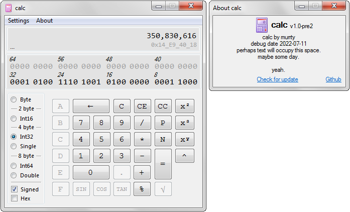

# calc
a programmer-oriented calculator to show more data at once

### This isn't meant to be a replacement calculator!!! ###
I'm sure there's some bugs and issues with it (like it WILL overflow/underflow, since it's not designed to check, it's designed to do what it's told), but that's because it's not really meant to do more than just be a simple tool to modify bits and get hex or value data instantly with added tools for quick manipulation of that data.

anyways, it looks like this  
  
* windows 7 not included

# questions!

* what's cc?  
That's "Clear calculation" which will reset the calculation value, which is the value that was input previously.

* does this support little endian?  
yes you can change between big and little endian whenever

* bug!!  
issues
